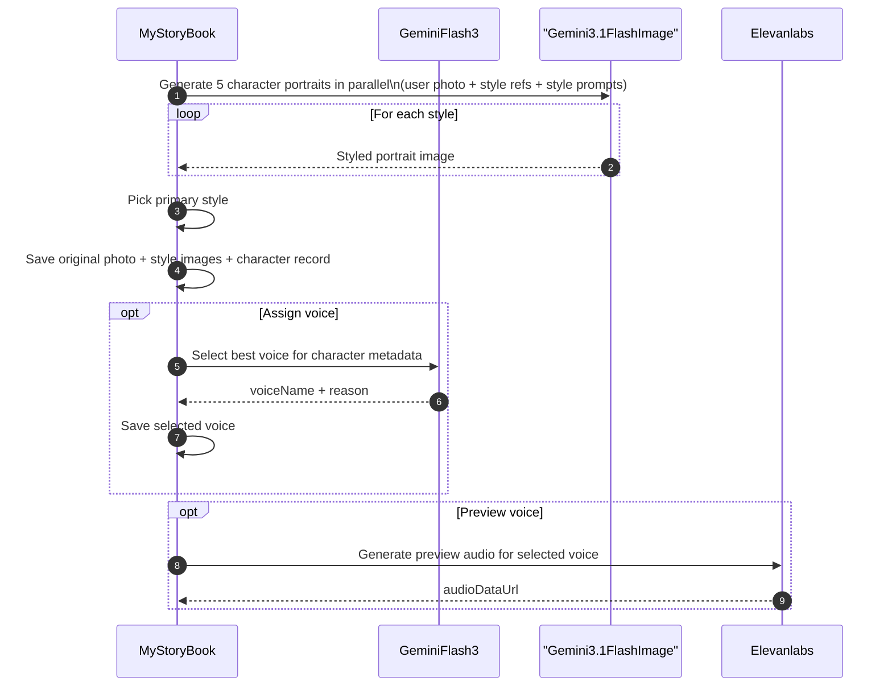
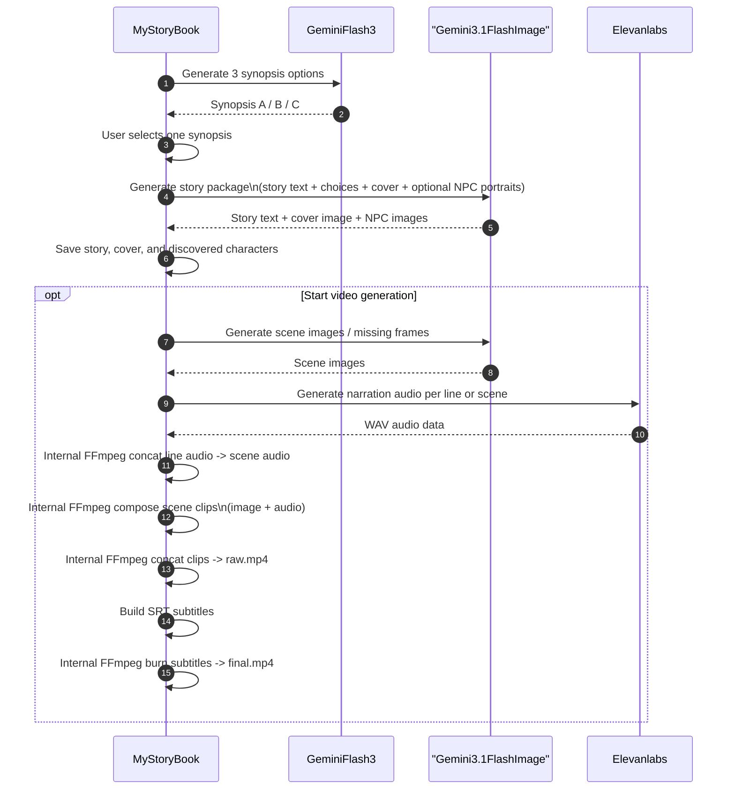

# Generation Sequence Diagrams

## Generate Character

```mermaid
sequenceDiagram
    autonumber
    participant MSB as MyStoryBook
    participant GF3 as GeminiFlash3
    participant G31I as "Gemini3.1FlashImage"
    participant EL as Elevanlabs

    MSB->>G31I: Generate 5 character portraits in parallel\n(user photo + style refs + style prompts)
    loop For each style
        G31I-->>MSB: Styled portrait image
    end

    MSB->>MSB: Pick primary style
    MSB->>MSB: Save original photo + style images + character record

    opt Assign voice
        MSB->>GF3: Select best voice for character metadata
        GF3-->>MSB: voiceName + reason
        MSB->>MSB: Save selected voice
    end

    opt Preview voice
        MSB->>EL: Generate preview audio for selected voice
        EL-->>MSB: audioDataUrl
    end
```

## Generate Story And Video

```mermaid
sequenceDiagram
    autonumber
    participant MSB as MyStoryBook
    participant GF3 as GeminiFlash3
    participant G31I as "Gemini3.1FlashImage"
    participant EL as Elevanlabs

    MSB->>GF3: Generate 3 synopsis options
    GF3-->>MSB: Synopsis A / B / C

    MSB->>MSB: User selects one synopsis

    MSB->>G31I: Generate story package\n(story text + choices + cover + optional NPC portraits)
    G31I-->>MSB: Story text + cover image + NPC images

    MSB->>MSB: Save story, cover, and discovered characters

    opt Start video generation
        MSB->>G31I: Generate scene images / missing frames
        G31I-->>MSB: Scene images

        MSB->>EL: Generate narration audio per line or scene
        EL-->>MSB: WAV audio data

        MSB->>MSB: Internal FFmpeg concat line audio -> scene audio
        MSB->>MSB: Internal FFmpeg compose scene clips\n(image + audio)
        MSB->>MSB: Internal FFmpeg concat clips -> raw.mp4
        MSB->>MSB: Build SRT subtitles
        MSB->>MSB: Internal FFmpeg burn subtitles -> final.mp4
    end
```
